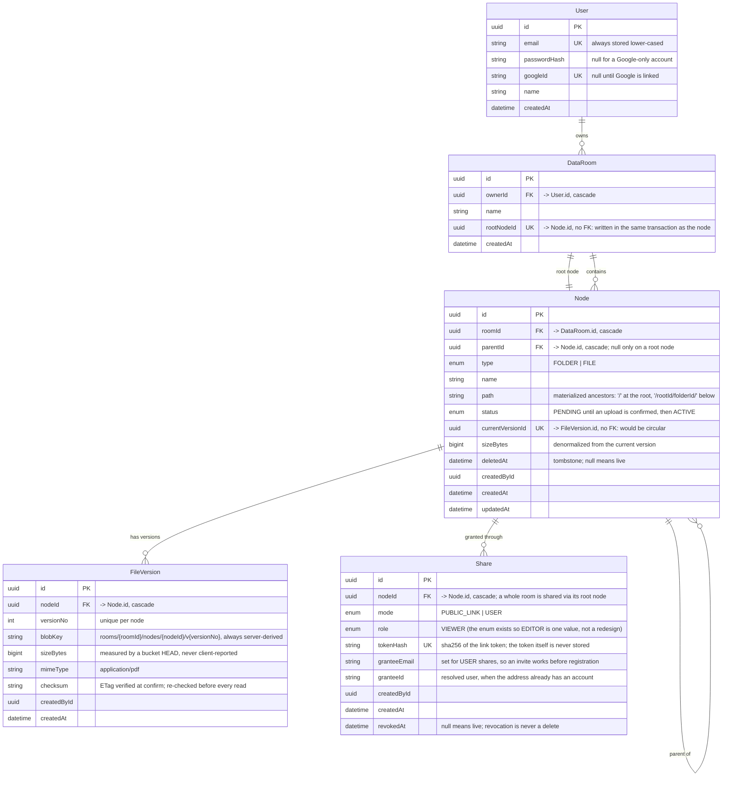

# Data model

Five tables, generated from `apps/api/prisma/schema.prisma`. Folders and files are the
same table; the tree is walked through a materialized `path` rather than recursion.

Three columns point at rows without a foreign key, and each is deliberate:

- `DataRoom.rootNodeId` and `Node.currentVersionId` would both close a cycle
  (`DataRoom -> Node -> DataRoom`, `Node -> FileVersion -> Node`), which Postgres can
  only satisfy with deferrable constraints. Both are written inside the transaction that
  creates the row they point at, and both carry a unique index.
- `Share.granteeId` is a convenience copy. The grant is keyed on `granteeEmail`, because
  an invitation has to work before the invitee has an account — resolving it to a user id
  is what happens when they register, not a precondition for the row existing.

## Indexes

Everything Prisma can describe lives in the schema; three indexes cannot be expressed
there and are hand-written in `prisma/migrations/20260819141425_indexes/migration.sql`.
All three are also declared in `schema.prisma` where Prisma has syntax for them, because
the diff engine treats an index it cannot see as drift and proposes dropping it.

| Index | Where it lives | Query it serves |
| --- | --- | --- |
| `node_name_uniq` — `unique (parentId, lower(name)) where deletedAt is null` | raw SQL | Name collisions inside one folder, decided by the database. Prisma cannot express either half: no functional index on `lower(name)`, no partial predicate. `@@unique([parentId, name, deletedAt])` would not work either — NULLs are distinct in Postgres, so it would enforce nothing at all on live rows. |
| `node_path_prefix` — `(roomId, path varchar_pattern_ops)` | raw SQL | Every subtree operation: rollups, recursive delete, move, scope checks. A plain btree on `path` is not used by `LIKE 'prefix%'` under a non-C collation; the pattern operator class is what makes the prefix scan an index scan. Prisma has no syntax for operator classes on btree. |
| `node_name_trgm` — `gin (name gin_trgm_ops)` | raw SQL + `@@index(..., type: Gin, map: "node_name_trgm")` | Substring name search. Currently unused (search is not built) but kept, so re-adding search is a query, not a migration. |
| `Node_parentId_name_id_idx` | schema | Listing one folder with keyset pagination, in name order, with no sort step. |
| `Node_roomId_path_idx` | schema | Prefix lookups Prisma itself issues, where the plan does not need the pattern class. |
| `Node_roomId_name_idx` | schema | Name lookups across a whole room, without the trigram index. |
| `Node_status_createdAt_idx` | schema | The hourly PENDING sweep: abandoned uploads older than 24 hours. |
| `Node_currentVersionId_key` | schema | One current version per node, enforced rather than assumed. |
| `FileVersion_nodeId_versionNo_key` | schema | Version numbering per file. |
| `Share_tokenHash_key` | schema | Public-link resolution in one indexed hit. |
| `Share_nodeId_granteeEmail_key` | schema | Re-inviting the same address is an upsert, not a duplicate row. |
| `Share_nodeId_revokedAt_idx` | schema | Listing live grants on a node. |
